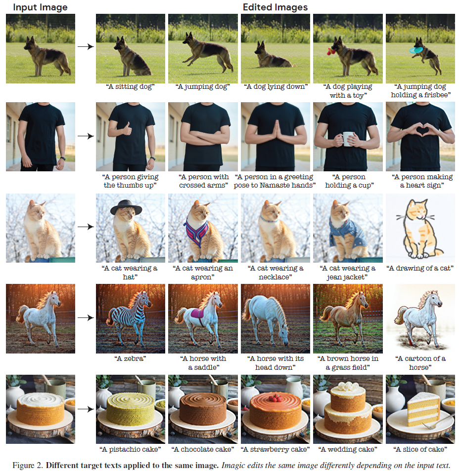
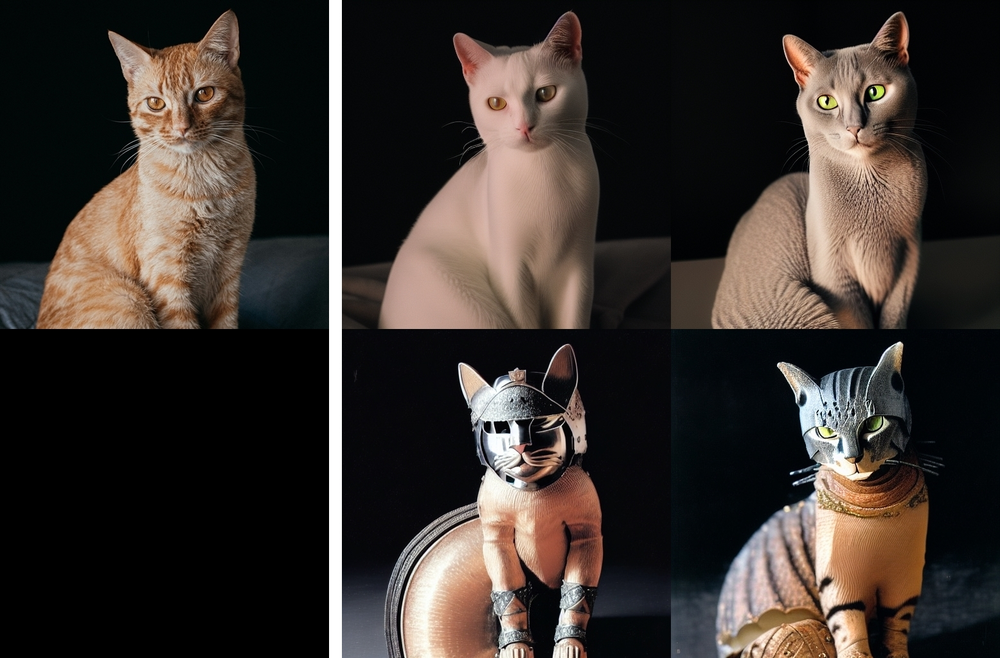
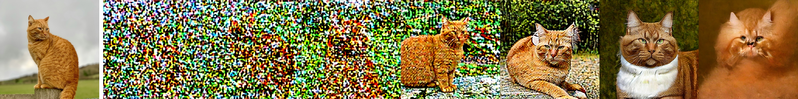
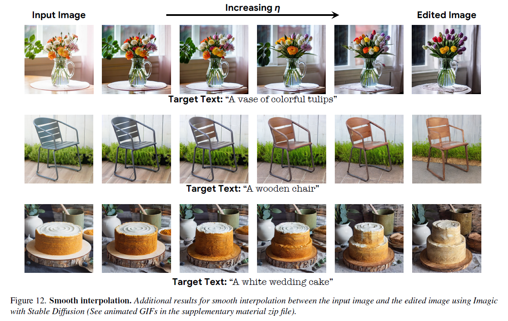

# Modified-Imagic-Stable-Diffusion-Pipeline

A modified version of Imagic pipeline with Stable Diffusion displaying progress.
The original version was introduced in huggingface diffusers community examples.

## Imagic

**Figure 1:** *Examples of Imagic with Imagen.*

## How to use

I used Jupyter Notebook with NVIDIA RTX A4000.
Imagic needs only 1 image & 1 prompt.
Write a prompt and load a single image, then run.
If "show_progress = False (default)" during training, it will takes about 1 hour.

## Modifications

1. The py file from [github - huggingface/diffusers](https://github.com/huggingface/diffusers/blob/main/examples/community/imagic_stable_diffusion.py) is noted that their pipeline is "modeled after the textual_inversion.py / train_dreambooth.py and the work of justinpinkney".
However some code lines are equivalent to the contents of [this page](https://medium.com/@chongdashu/papers-decoded-imagic-text-based-real-image-editing-with-diffusion-models-b1bda8b2532a), but there are dummy or missing parts.
So I edited them.

2. A bit of efficiency improvement

3. The pipeline samples images and displays them to show how things are going, if you want.

etc: I didn't edited any of the original annotations in py file.

## Performances

**Figure 2:** *Examples*

The original pipeline with default settings prints awful images. 
On the other hand, the modified one produces better images, but quite disappointing.
In trivial, The differences between the original and the modified are hyperparameters, schedulers, and the 1st modification.

**Figure 3:** *Result of the original pipeline with default settings*

Anyway, the core problem is that Imagic pipeline does not work well with Stable Diffusion, unlike Imagen.
It means that if you try to fully preserve important characteristics in an image such as identity or face, then overfitting happens.
Meanwhile, if you use a trick like controling diffusion steps to prevent such overfitting, then the prompt loses the power and only minor changes occur.
e.g.
1. a ginger cat => the same cat with gray or white fur: relatively easy;
2. a cat => the same cat dressed like a musketeer or a medieval knight: maybe impossible or poor quality;

The reason is probably that Stable diffusion deals with the latent of an image in the semantic latent space, while Imagen dealing with an image in the pixel space.

Perhaps this is why the author's of Imagic paper only presented inanimate object examples for their applications of Stable Diffusion like this:

**Figure 4:** *Examples of Imagic with Stable Diffusion.*

## References

- Kawar, Bahjat, et al. "Imagic: Text-based real image editing with diffusion models." Proceedings of the IEEE/CVF Conference on Computer Vision and Pattern Recognition. 2023.

- https://github.com/huggingface/diffusers/blob/main/examples/community/imagic_stable_diffusion.py

- https://medium.com/@chongdashu/papers-decoded-imagic-text-based-real-image-editing-with-diffusion-models-b1bda8b2532a

## Image sources

- https://unsplash.com/photos/orange-tabby-cat-on-brown-wooden-fence-during-daytime-RzZ3VlIPCDE

- https://unsplash.com/photos/orange-tabby-cat-on-black-textile-PjQ4GoHY7r0